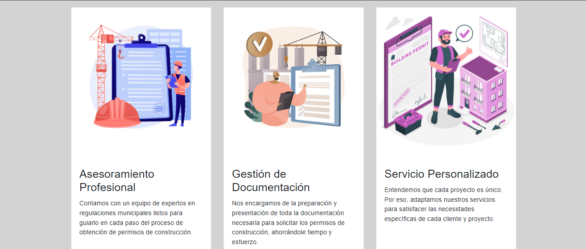

# Quiz1

Enlace del sitio web: https://main--agencia-permisos-construccion.netlify.app/

index.html  

Sistema de Agencia de Permisos de Construcción  
El archivo index.html sirve como la página principal de nuestro sistema, la cual proporciona información sobre la agencia de permisos de construcción.

Información de la Agencia  
Esta sección proporciona detalles sobre la agencia y los servicios que ofrece.

Esta sección se divide en tres partes:  
1. Asesoramiento Profesional  
2. Gestión de Documentación  
3. Servicios Personalizados  
Formularios  
Aquí se encuentran los formularios disponibles para los usuarios:

El botón de Documentación en línea enviará al usuario a la siguiente página, llamada "Explicación", donde se detallarán los pasos a seguir para solicitar algún tipo de permiso de construcción.  
Los usuarios también tendrán la opción de descargar el formulario en formato PDF, mediante el botón Descargar formulario.  

explicacion.html  

El archivo "explicacion.html" sirve como la página explicativa de la agencia de permisos de construcción de nuestro sistema, la cual proporciona información sobre permisos de construcción y demás detalles sobre los servicios brindados.

La segunda sección está dividida en varias partes; la primera es sobre si la obra es menor a los 40 metros cuadrados, la Segunda sobre si la obra es mayor a los 40 metros cuadrados, los proyectos urbanísticos con sus  respectivos requisitos, las torres de telecomunicaciones con sus requisitos y, por último, una aclarción sobre las obras menores.

Esta sección se divide en dos partes:  
Vídeos profesionales para brindar ayuda al cliente y retroalimentar el conocimiento que brinda la página.

En la sección a continuación, en el botón de Ir al formulario, se redirigirá al usuario a la siguiente página llamada "formulario", donde podrá llenar el formulario en línea con la información solicitada.  
Además, el usuario tendrá la opción de llenar dicho formulario fuera de línea, con la descarga del mismo, por medio del botón Descargar Formulario.  

formulario.html

En este archivo se contiene la página del formulario en línea que el usuario podrá llenar con sus datos personales y los de la obra.  
Este formulario consta de varias secciones, la primera es sobre información del propietario o propietaria.

La siguiente sección solicita información sobre la propiedad sobre la que se construirá la obra.

La siguiente sección solicita información relevante sobre la obra como tal, qué tipo de obra será, valor y costo, tamaño, materiales que se usarán, tiempo que tardará y tipo de financiamiento para realizarla.

Por último, se solicita información sobre el profesional encargado de la obra y demás datos importantes. Además, en esta parte se encuentra el botón para enviar el formulario.

