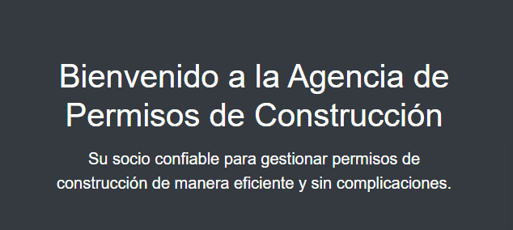

# Quiz1
Index.html
Sistema de Agencia de Permisos de Construcción
El archivo index.html sirve como la página principal de nuestro sistema, que proporciona información sobre nuestra agencia de permisos de construcción.

Contenido
Información de la Agencia:
Imagen de la Agencia
Esta sección proporciona detalles sobre nuestra agencia y sus servicios.

Servicios Ofrecidos:
Esta sección se divide en tres partes:

Asesoramiento Profesional.
Gestión de Documentación.
Servicios Personalizados.
Imagen de los Servicios
Formularios:
Aquí se encuentran los formularios disponibles para los usuarios:

Formulario en Línea:
Este formulario se enviará a la siguiente página llamada "Explicación", donde se detallarán los pasos a seguir.
Formulario en PDF:
Los usuarios pueden descargar este formulario en formato PDF.
Imagen de los Formularios
Instrucciones Adicionales
Explicación: La página a la que se redirige desde el formulario en línea (explicacion.html) debe proporcionar una explicación detallada de los procedimientos y requisitos para completar el formulario y obtener los servicios de la agencia.

explicacion.html

